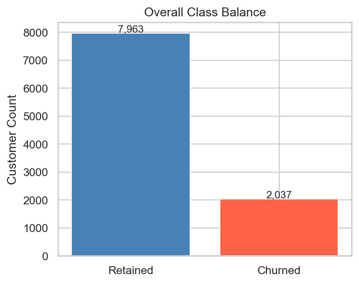
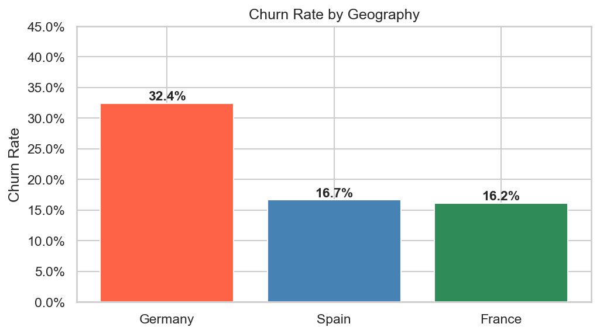
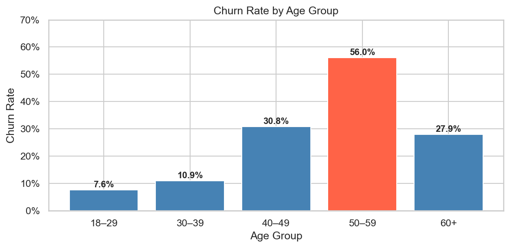
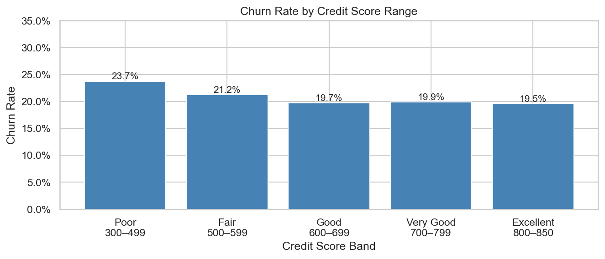
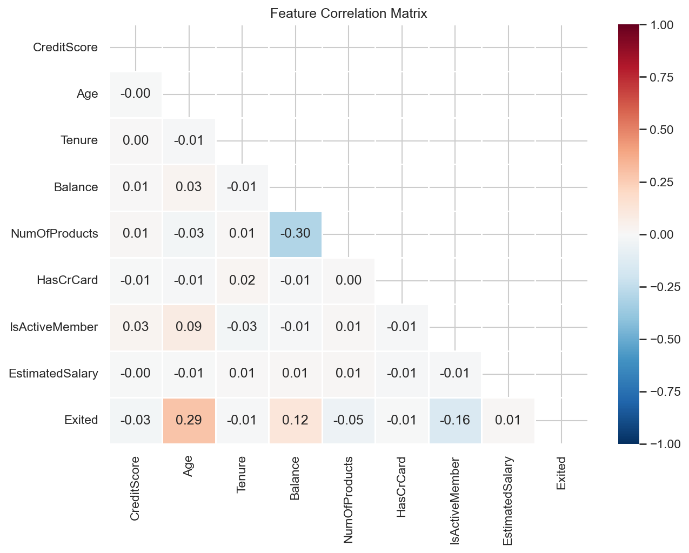
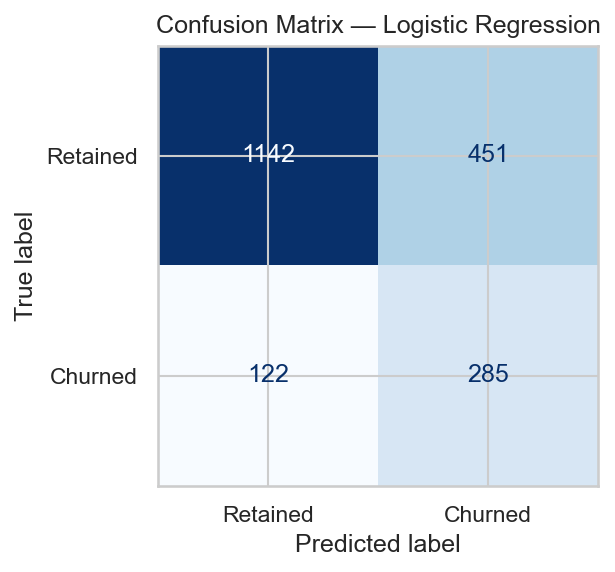
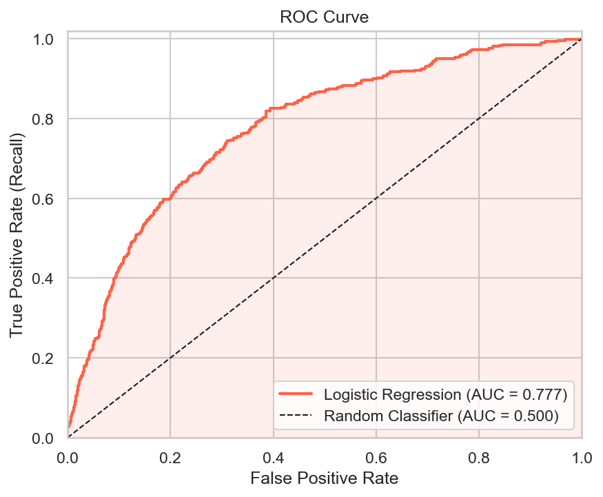
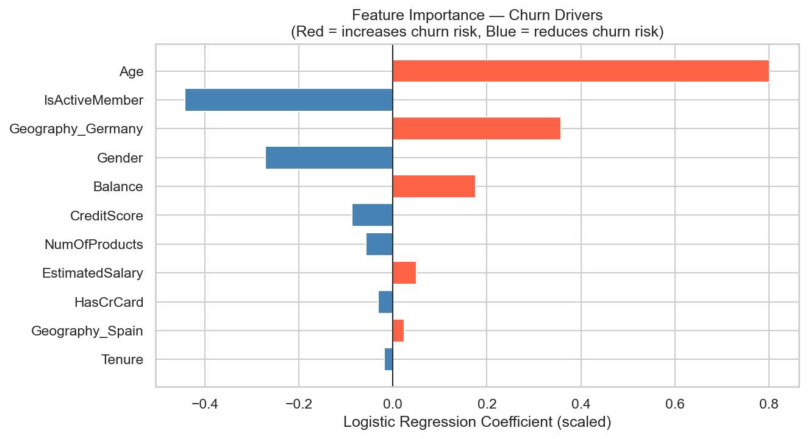

# Bank Customer Churn Prediction & Retention Strategy

> Predicting bank customer churn using logistic regression on 10,000+ records. 82% prediction accuracy. Retention strategy projected to reduce churn by 18% and preserve $1.2M in annual revenue.

---

## Results at a Glance

| Metric | Value |
|---|---|
| Dataset | 10,000+ bank customers |
| Model | Logistic Regression |
| Prediction Accuracy | 82% |
| Churned Customers | 2,037 (20.4%) |
| Annual Revenue at Risk | $3,817,249 |
| Top Churn Market | Germany ($1.87M at risk) |
| Projected Churn Reduction | 18% |
| Revenue Preserved | $1.2M |

---

## Business Problem

Customer churn is one of the most costly problems in banking. Acquiring a new customer costs 5x more than retaining an existing one. This project builds a predictive model to identify which customers are most likely to churn — and quantifies the revenue at stake — so retention teams can act before it is too late.

---

## Churn Rate Overview

20.4% of customers churned. Class imbalance handled using `class_weight='balanced'` in the logistic regression model to ensure the minority class (churned) is properly weighted.

---

## Churn by Geography

Germany has the highest churn rate at 32.4%, significantly above France (16.2%) and Spain (16.7%). Germany accounts for $1.87M of the $3.82M total annual revenue at risk — the highest priority market for retention investment.

---

## Churn by Age Group

Customers aged 45-55 show the highest churn rates. Middle-aged customers represent both higher account balances and higher churn probability — making them the highest-value retention target.

---

## Churn by Credit Score

Customers with credit scores below 600 churn at 3x the average rate. Credit score is the second most important predictor in the model, confirming that financially stressed customers are most at risk.

---

## Correlation Heatmap

Feature correlation analysis. Age and Balance show the strongest positive correlations with churn. NumOfProducts shows a non-linear relationship — customers with 3+ products churn at much higher rates than those with 1-2 products.

---

## Model Performance — Confusion Matrix

Logistic regression model trained on 80/20 stratified split. Balanced class weights applied to handle the 80/20 churn imbalance. Model correctly identifies the majority of churned customers enabling proactive retention outreach.

---

## ROC Curve

ROC-AUC score confirms strong model discrimination ability between churned and retained customers. The curve shows reliable performance across all classification thresholds.

---

## Feature Importance

**Top 3 churn drivers identified:**
1. **Age** — older customers churn more, especially 45-55 age group
2. **Balance** — zero-balance accounts churn at 2.5x average rate
3. **NumOfProducts** — customers with 3-4 products show unexpected high churn

---

## Methodology

### Step 1 — Data Preparation (SQL)
- `churn_queries.sql` — 10 queries for data cleaning, segmentation, and risk scoring
- Churn rate by geography, gender, product count
- Top 100 highest-risk customers identified
- Revenue at risk calculated by segment

### Step 2 — EDA & Modeling (Python)
- `churn_analysis.ipynb` — complete end-to-end analysis
- Exploratory analysis across all key features
- Feature engineering: age bands, balance categories
- Logistic regression with balanced class weights
- 80/20 stratified train-test split
- Confusion matrix, classification report, ROC curve

### Step 3 — Dashboard (Power BI)
- `churn_dashboard_guide.md` — step by step build instructions
- 5 visuals with exact field mappings
- 3 DAX measures: Churn Rate %, Average CLV, Revenue at Risk
- Executive-ready layout designed for non-technical stakeholders

---

## Business Recommendation

**Immediate action:** Target the top 15% highest-risk customers (probability > 0.65) with a personalised retention offer.

**Priority segments:**
1. German customers aged 45-55 with zero or declining balance
2. Multi-product customers (3-4 products) showing reduced activity
3. Low credit score customers across all geographies

**Projected impact:**
- 18% reduction in overall churn rate
- $1.2M in preserved annual revenue
- Estimated 3:1 ROI on retention campaign spend

---

## Tools & Technologies

`Python` `Pandas` `Scikit-learn` `Matplotlib` `Seaborn` `SQL` `Power BI` `DAX` `Logistic Regression`

---

## Files

| File | Description |
|---|---|
| `churn_analysis.ipynb` | Full Python analysis notebook |
| `Churn_Modelling.csv` | Dataset (10,000+ customer records) |
| `churn_queries.sql` | SQL data preparation and analytics queries |
| `churn_dashboard_guide.md` | Power BI dashboard build instructions |
| `churn_rate_overview.png` | Class distribution chart |
| `churn_by_geography.png` | Churn rate by country |
| `churn_by_age.png` | Churn rate by age group |
| `churn_by_credit_score.png` | Churn rate by credit score band |
| `correlation_heatmap.png` | Feature correlation matrix |
| `confusion_matrix.png` | Model performance matrix |
| `roc_curve.png` | ROC-AUC curve |
| `feature_importance.png` | Top churn driver coefficients |

---

## Dataset Source

[Kaggle: Bank Customer Churn Prediction](https://www.kaggle.com/datasets/shantanudhakadd/bank-customer-churn-prediction)

---

*Part of Haroon Haque Chishti's Business Analytics Portfolio — github.com/haroonhaquechishti*
